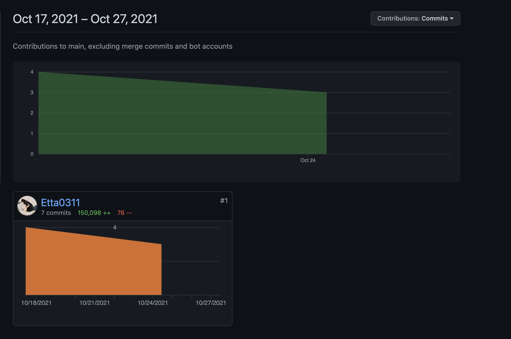

# ReadMe Generator

## Description
     A Readme Generator is aimed to reduce workload of developers from writing a Readme file.
     As Readme file usually will be the first file viewed by users and other developers,
     A detailed Readme file could help a lot so that developers can save their time from explaining their projects
     So do viewers could build up a picture about what product they are expecting from a project
     With this Generator, developers can simply entering the info they'd like to put in Readme and antoamtically created clean and informative Readme for their project.
     Even though this could only help to build Readme with the infomations in a simple , develops can then add on extras features from the basis of readme file that with framework.

## Table of Contents

   - Techniques used
   - Usage
   - Credits
   - License

## Techniques used

   - Javascript
   - Node.js

## Usage
    View the full DEMO video from RMimages folder

## Contributors

## Credits
    - https://coding-boot-camp.github.io/full-stack/github/professional-readme-guid
    - https://choosealicense.com/
    - https://shields.io/

## License
MIT License

Copyright (c) [2021] [Ettaho]

Permission is hereby granted, free of charge, to any person obtaining a copy
of this software and associated documentation files (the "Software"), to deal
in the Software without restriction, including without limitation the rights
to use, copy, modify, merge, publish, distribute, sublicense, and/or sell
copies of the Software, and to permit persons to whom the Software is
furnished to do so, subject to the following conditions:

The above copyright notice and this permission notice shall be included in all
copies or substantial portions of the Software.

THE SOFTWARE IS PROVIDED "AS IS", WITHOUT WARRANTY OF ANY KIND, EXPRESS OR
IMPLIED, INCLUDING BUT NOT LIMITED TO THE WARRANTIES OF MERCHANTABILITY,
FITNESS FOR A PARTICULAR PURPOSE AND NONINFRINGEMENT. IN NO EVENT SHALL THE
AUTHORS OR COPYRIGHT HOLDERS BE LIABLE FOR ANY CLAIM, DAMAGES OR OTHER
LIABILITY, WHETHER IN AN ACTION OF CONTRACT, TORT OR OTHERWISE, ARISING FROM,
OUT OF OR IN CONNECTION WITH THE SOFTWARE OR THE USE OR OTHER DEALINGS IN THE
SOFTWARE.
=======
